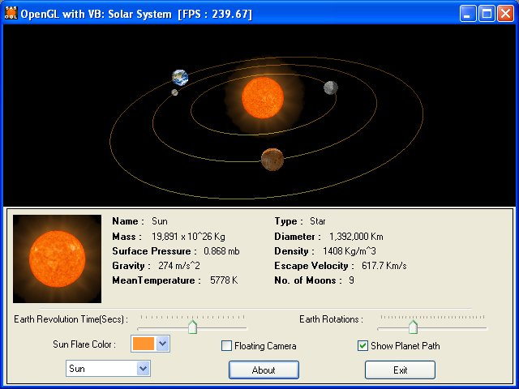



## VB\-OpenGL : Solar System XP

### Description

A comprehensive program

that demonstrate use of OpenGL Graphics API in Visual

Basic Environmnet. It covers Ligthing, Bitmap(.bmp) Texture loading using Windows API, Hi Resolution Timer support, Time-based Animations and more Advanced Topics like Multiple viewports and Mouse Picking(Mouse support for OpenGL).

Whats New (in Updated Version):

Sun FLare Colors Selection, Floating Camera, Planet Path Lines and WinXP GUI Style.
 
### More Info
 

             |
---                |---
**Submitted On**   |2003-08-20 07:08:06
**By**             |[Saadat Ali Shah](https://github.com/Planet-Source-Code/PSCIndex/blob/master/ByAuthor/saadat-ali-shah.md)
**Level**          |Intermediate
**User Rating**    |5.0 (198 globes from 40 users)
**Compatibility**  |VB 5\.0, VB 6\.0
**Category**       |[Graphics](https://github.com/Planet-Source-Code/PSCIndex/blob/master/ByCategory/graphics__1-46.md)
**World**          |[Visual Basic](https://github.com/Planet-Source-Code/PSCIndex/blob/master/ByWorld/visual-basic.md)
**Archive File**   |[VB\-OpenGL\_1632678202003\.zip](https://github.com/Planet-Source-Code/saadat-ali-shah-vb-opengl-solar-system-xp__1-47711/archive/master.zip)

